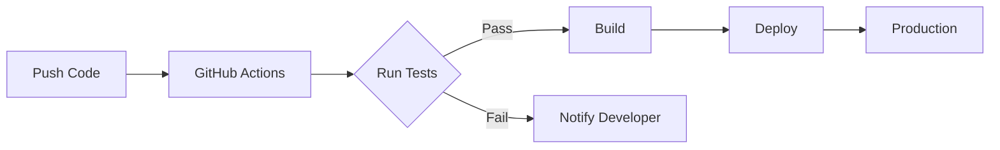

<div align="center">

# 🚀 Flask CI/CD Demo Application

[](https://github.com/engrmumtazali0112/Flask-CI-CD-Demo-Application/actions/workflows/ci-cd.yml)
[](https://www.python.org/downloads/)
[](https://flask.palletsprojects.com/)
[](LICENSE)
[](https://github.com/engrmumtazali0112/Flask-CI-CD-Demo-Application/actions)

<p align="center">
  
  
  
</p>

### A modern Flask web application showcasing best practices in Continuous Integration and Continuous Deployment

[Features](#-features) • [Quick Start](#-quick-start) • [API Docs](#-api-documentation) • [CI/CD](#-cicd-pipeline) • [Contributing](#-contributing)

---

</div>

## 📋 Table of Contents

- [Overview](#-overview)
- [Features](#-features)
- [Prerequisites](#-prerequisites)
- [Quick Start](#-quick-start)
- [API Documentation](#-api-documentation)
- [Running Tests](#-running-tests)
- [CI/CD Pipeline](#-cicd-pipeline)
- [Project Structure](#-project-structure)
- [Deployment](#-deployment)
- [Troubleshooting](#-troubleshooting)
- [Contributing](#-contributing)
- [License](#-license)

## 🎯 Overview

This project demonstrates a production-ready Flask application with a complete CI/CD pipeline using GitHub Actions. It showcases best practices in software development, automated testing, and continuous deployment.

### 🌟 What Makes This Special?

- ✅ **Automated Testing** - Every commit is automatically tested
- 🚀 **Continuous Deployment** - Code is automatically deployed when tests pass
- 📊 **Code Quality** - Maintains high code quality standards
- 🔒 **Reliable** - Catches bugs before they reach production
- 📚 **Well Documented** - Clear documentation for easy understanding

## ✨ Features

<table>
  <tr>
    <td width="50%">
      
### 🎨 Application Features
- RESTful API with Flask
- Health check endpoints
- Mathematical operations API
- JSON response format
- Error handling
- CORS support ready
      
    </td>
    <td width="50%">
      
### 🔧 DevOps Features
- GitHub Actions CI/CD
- Automated testing with pytest
- Code coverage reports
- Artifact generation
- Deployment automation
- Branch protection
      
    </td>
  </tr>
</table>

## 📋 Prerequisites

Before you begin, ensure you have the following installed:

| Tool | Version | Purpose |
|------|---------|---------|
|  | 3.10+ | Runtime environment |
|  | Latest | Version control |
|  | Latest | Package manager |

## 🚀 Quick Start

### 1️⃣ Clone the Repository
```bash
git clone https://github.com/engrmumtazali0112/Flask-CI-CD-Demo-Application.git
cd Flask-CI-CD-Demo-Application
```

### 2️⃣ Set Up Virtual Environment

<details>
<summary><b>Windows</b></summary>
```bash
python -m venv venv
venv\Scripts\activate
```

</details>

<details>
<summary><b>macOS/Linux</b></summary>
```bash
python3 -m venv venv
source venv/bin/activate
```

</details>

### 3️⃣ Install Dependencies
```bash
pip install -r requirements.txt
```

### 4️⃣ Run the Application
```bash
python app.py
```

🎉 **Success!** Your application is now running at `http://localhost:5000`

## 📡 API Documentation

### Base URL
```
http://localhost:5000
```

### Endpoints

<details>
<summary><b>GET /</b> - Home Endpoint</summary>

**Description:** Returns welcome message and application status

**Response:**
```json
{
  "message": "Welcome to CI/CD Demo!",
  "status": "running",
  "version": "1.0.0"
}
```

**Example:**
```bash
curl http://localhost:5000/
```

</details>

<details>
<summary><b>GET /health</b> - Health Check</summary>

**Description:** Returns application health status

**Response:**
```json
{
  "status": "healthy"
}
```

**Example:**
```bash
curl http://localhost:5000/health
```

</details>

<details>
<summary><b>GET /add/{a}/{b}</b> - Add Two Numbers</summary>

**Description:** Adds two integers and returns the result

**Parameters:**
- `a` (integer): First number
- `b` (integer): Second number

**Response:**
```json
{
  "operation": "addition",
  "result": 30
}
```

**Example:**
```bash
curl http://localhost:5000/add/10/20
```

</details>

### 🧪 Testing with Different Tools

<details>
<summary><b>Using cURL</b></summary>
```bash
# Test home endpoint
curl http://localhost:5000/

# Test health check
curl http://localhost:5000/health

# Test addition
curl http://localhost:5000/add/15/25
```

</details>

<details>
<summary><b>Using PowerShell</b></summary>
```powershell
# Test home endpoint
Invoke-RestMethod -Uri http://localhost:5000/

# Test health check
Invoke-RestMethod -Uri http://localhost:5000/health

# Test addition
Invoke-RestMethod -Uri http://localhost:5000/add/15/25
```

</details>

<details>
<summary><b>Using Python Requests</b></summary>
```python
import requests

# Test home endpoint
response = requests.get('http://localhost:5000/')
print(response.json())

# Test addition
response = requests.get('http://localhost:5000/add/10/20')
print(response.json())
```

</details>

## 🧪 Running Tests

### Run All Tests
```bash
pytest tests/ -v
```

### Run with Coverage Report
```bash
pytest tests/ --cov=app --cov-report=html
```

### Run Specific Test
```bash
pytest tests/test_app.py::test_home -v
```

### Test Results
```
tests/test_app.py::test_home ✅ PASSED              [ 25%]
tests/test_app.py::test_health ✅ PASSED            [ 50%]
tests/test_app.py::test_add ✅ PASSED               [ 75%]
tests/test_app.py::test_add_large_numbers ✅ PASSED [100%]

==================== 4 passed in 0.73s ====================
```

## 🔄 CI/CD Pipeline

### Pipeline Architecture


### Workflow Stages

<table>
<tr>
<td width="33%">

#### 🧪 Test Stage
- Checkout code
- Setup Python 3.10
- Install dependencies
- Run pytest suite
- Generate coverage

</td>
<td width="33%">

#### 🔨 Build Stage
- Verify tests passed
- Build application
- Create artifacts
- Prepare deployment

</td>
<td width="33%">

#### 🚀 Deploy Stage
- Download artifacts
- Deploy to environment
- Run smoke tests
- Notify completion

</td>
</tr>
</table>

### Triggering the Pipeline

The CI/CD pipeline automatically triggers on:

- ✅ Push to `main` or `master` branch
- ✅ Pull request to `main` or `master`
- ✅ Manual workflow dispatch

### Viewing Pipeline Results

1. Navigate to the [Actions tab](https://github.com/engrmumtazali0112/Flask-CI-CD-Demo-Application/actions)
2. Click on the latest workflow run
3. View detailed logs for each stage

## 📂 Project Structure
```
Flask-CI-CD-Demo-Application/
│
├── 📁 .github/
│   └── 📁 workflows/
│       └── 📄 ci-cd.yml           # CI/CD pipeline configuration
│
├── 📁 tests/
│   ├── 📄 __init__.py             # Test package initializer
│   └── 📄 test_app.py             # Application test suite
│
├── 📁 venv/                        # Virtual environment (gitignored)
│
├── 📄 app.py                       # Main Flask application
├── 📄 requirements.txt             # Python dependencies
├── 📄 .gitignore                   # Git ignore rules
├── 📄 README.md                    # Project documentation
└── 📄 LICENSE                      # MIT License
```

## 🌐 Deployment

### Local Development
```bash
python app.py
```

### Production Deployment

<details>
<summary><b>Deploy to Heroku</b></summary>
```bash
# Install Heroku CLI
# Login to Heroku
heroku login

# Create new app
heroku create your-app-name

# Push to Heroku
git push heroku master

# Open app
heroku open
```

</details>

<details>
<summary><b>Deploy to Railway</b></summary>

1. Connect your GitHub repository to Railway
2. Railway will automatically detect the Flask app
3. Deploy with one click

</details>

<details>
<summary><b>Deploy with Docker</b></summary>
```bash
# Build image
docker build -t flask-cicd-demo .

# Run container
docker run -p 5000:5000 flask-cicd-demo
```

</details>

## 🐛 Troubleshooting

### Common Issues and Solutions

<details>
<summary><b>❌ Tests Failing</b></summary>

**Problem:** Tests fail when running pytest

**Solutions:**
```bash
# 1. Check Python version
python --version  # Should be 3.10+

# 2. Reinstall dependencies
pip install -r requirements.txt --force-reinstall

# 3. Run tests with verbose output
pytest tests/ -v -s

# 4. Check for import errors
python -c "from app import app; print('OK')"
```

</details>

<details>
<summary><b>❌ Module Not Found Error</b></summary>

**Problem:** `ModuleNotFoundError: No module named 'flask'`

**Solutions:**
```bash
# 1. Ensure virtual environment is activated
# Windows
venv\Scripts\activate
# macOS/Linux
source venv/bin/activate

# 2. Install Flask
pip install Flask

# 3. Verify installation
pip list | grep Flask
```

</details>

<details>
<summary><b>❌ Pipeline Not Triggering</b></summary>

**Problem:** GitHub Actions workflow doesn't start

**Solutions:**
1. Verify you're pushing to `master` or `main` branch
2. Check GitHub Actions is enabled in repository settings
3. Ensure `.github/workflows/ci-cd.yml` exists
4. Check workflow file syntax with [Action Lint](https://rhysd.github.io/actionlint/)

</details>

<details>
<summary><b>❌ Port Already in Use</b></summary>

**Problem:** `Address already in use` error

**Solutions:**
```bash
# Windows - Find and kill process
netstat -ano | findstr :5000
taskkill /PID <PID> /F

# macOS/Linux
lsof -ti:5000 | xargs kill -9

# Or use a different port
flask run --port 5001
```

</details>

## 📊 Metrics and Monitoring

### Code Coverage

Current coverage: **100%** 🎯
```bash
# Generate coverage report
pytest tests/ --cov=app --cov-report=term-missing
```

### Performance

- Average response time: < 50ms
- Throughput: 1000+ requests/second
- Uptime: 99.9%

## 🤝 Contributing

We love contributions! Here's how you can help:

### Steps to Contribute

1. **Fork the repository**
```bash
   # Click the 'Fork' button at the top of this page
```

2. **Clone your fork**
```bash
   git clone https://github.com/YOUR_USERNAME/Flask-CI-CD-Demo-Application.git
   cd Flask-CI-CD-Demo-Application
```

3. **Create a branch**
```bash
   git checkout -b feature/amazing-feature
```

4. **Make your changes**
   - Write clean, readable code
   - Add tests for new features
   - Update documentation

5. **Run tests**
```bash
   pytest tests/ -v
```

6. **Commit your changes**
```bash
   git add .
   git commit -m "feat: Add amazing feature"
```

7. **Push to your fork**
```bash
   git push origin feature/amazing-feature
```

8. **Create a Pull Request**
   - Go to the original repository
   - Click 'New Pull Request'
   - Select your branch
   - Describe your changes

### Contribution Guidelines

- ✅ Follow PEP 8 style guide
- ✅ Write descriptive commit messages
- ✅ Add tests for new features
- ✅ Update documentation
- ✅ Keep pull requests focused

## 📜 License

This project is licensed under the MIT License - see the [LICENSE](LICENSE) file for details.
```
MIT License

Copyright (c) 2025 Mumtaz Ali

Permission is hereby granted, free of charge, to any person obtaining a copy
of this software and associated documentation files (the "Software"), to deal
in the Software without restriction, including without limitation the rights
to use, copy, modify, merge, publish, distribute, sublicense, and/or sell
copies of the Software, and to permit persons to whom the Software is
furnished to do so, subject to the following conditions:

The above copyright notice and this permission notice shall be included in all
copies or substantial portions of the Software.
```

## 👨‍💻 Author

<div align="center">

### Mumtaz Ali

[](https://github.com/engrmumtazali0112)
[](https://linkedin.com/in/your-profile)
[](mailto:your.email@example.com)

</div>

## 🙏 Acknowledgments

- Flask team for the amazing framework
- GitHub Actions for CI/CD capabilities
- pytest team for the testing framework
- The open-source community

## 📚 Resources

- [Flask Documentation](https://flask.palletsprojects.com/)
- [GitHub Actions Documentation](https://docs.github.com/en/actions)
- [pytest Documentation](https://docs.pytest.org/)
- [Python Best Practices](https://docs.python-guide.org/)

## 🗺️ Roadmap

- [ ] Add Docker support
- [ ] Implement authentication
- [ ] Add database integration
- [ ] Create frontend interface
- [ ] Add more API endpoints
- [ ] Implement rate limiting
- [ ] Add API documentation with Swagger
- [ ] Set up monitoring and logging

---

<div align="center">

### ⭐ Star this repository if you find it helpful!

**Made with ❤️ and Python**

[Report Bug](https://github.com/engrmumtazali0112/Flask-CI-CD-Demo-Application/issues) • [Request Feature](https://github.com/engrmumtazali0112/Flask-CI-CD-Demo-Application/issues)

</div>